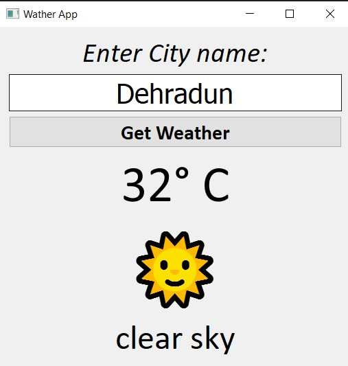

# 🌤️ Weather App

A simple desktop weather application built with Python that displays real-time weather information for any city using a weather API.

## ✨ Features

- 🔍 Search weather by city
- 🌡️ Current temperature
- ☁️ Weather condition
- 📝 Error handling for invalid cities

---

## 🖼️ Screenshot
```md

```

---

## 🛠️ Technologies Used

- Python
- PyQT5 (GUI)
- Requests
- python-dotenv
- OpenWeather API

---

## 📦 Installation

### 1. Clone the repository

```bash
git clone https://github.com/yourusername/weather-app.git
```

### 2. Navigate to the project

```bash
cd weather-app
```

### 3. Create a virtual environment

Windows

```bash
python -m venv .venv
```

Activate it

```bash
.venv\Scripts\activate
```

### 4. Install dependencies

```bash
pip install -r requirements.txt
```

---

## 🔑 Environment Variables

Create a `.env` file in the project root.

```env
API_KEY=YOUR_OPENWEATHER_API_KEY
```

Replace `YOUR_OPENWEATHER_API_KEY` with your own API key.

---

## ▶️ Running the Application

```bash
python main.py
```

---

## 🔮 Future Improvements

- 5-day weather forecast
- Search history
- Temperature unit toggle (°C / °F)

---

## Acknowledgement:

Weather data provided by the OpenWeather API.

---
